# NoteBlocks_Front
### 一个集成记录文字、图片、音频和提醒功能与一身的便签软件。

[NoteBlocks_Server](https://github.com/cenganhui/NodeBlocks_Server)

## 主要功能
- 实现了文字、图片和音频的交杂显示与存储
- 实现了添加闹钟提醒功能
- 实现了以网页方式分享便签功能
- 实现了本地导出和导入功能
- 实现了用户注册和登录功能
- 实现了云备份和云恢复功能

## 主页面
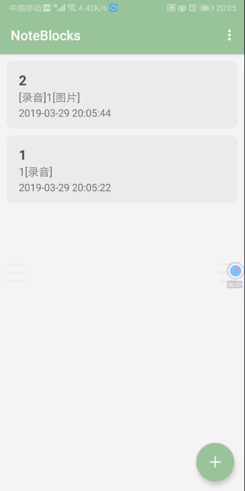

## 便签页面

## 录音
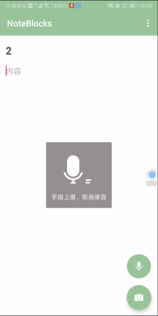

## 闹钟提醒
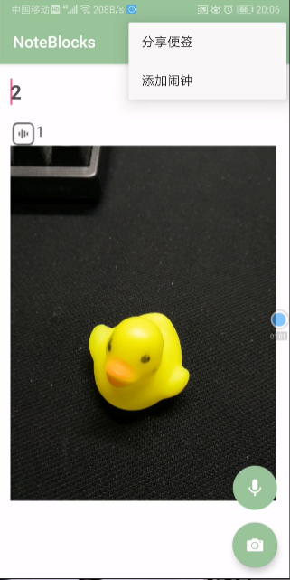
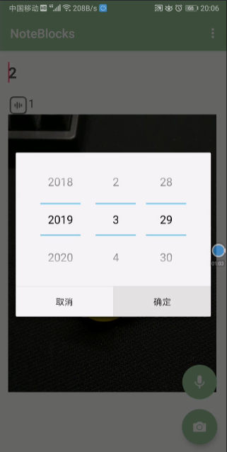

## 分享便签
#### 进入一个便签页面->点击分享便签->用户登录验证->分享地址->浏览器打开->显示分享的便签页面
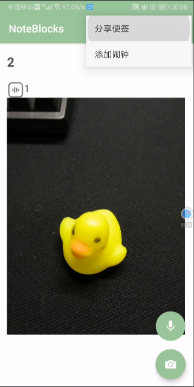
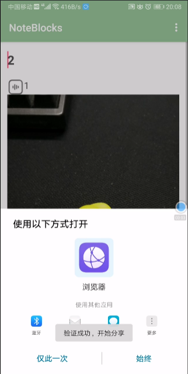
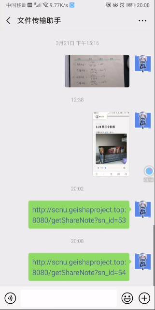
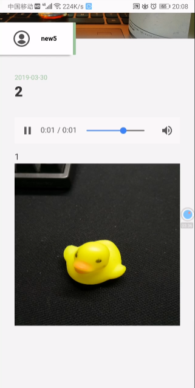

## 导出和导入
#### 把当前便签导出到本地->将当前便签删除->选择导入->选择指定文件->将便签导入
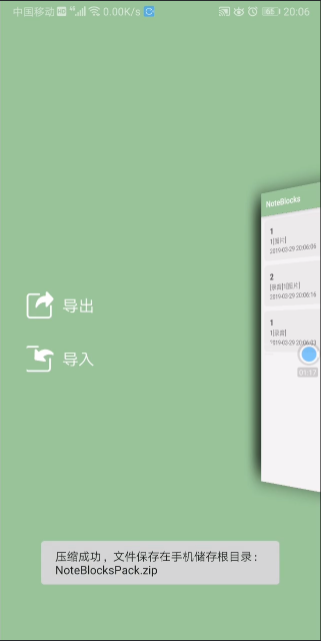
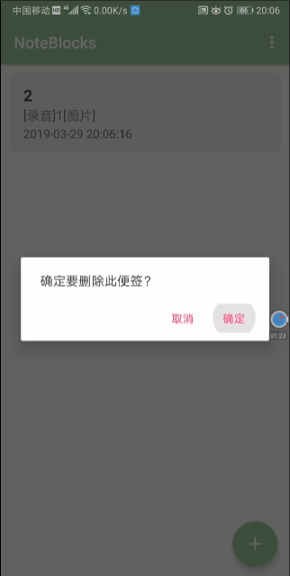
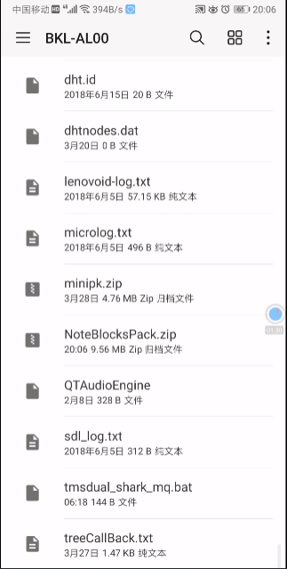

## 注册和登录
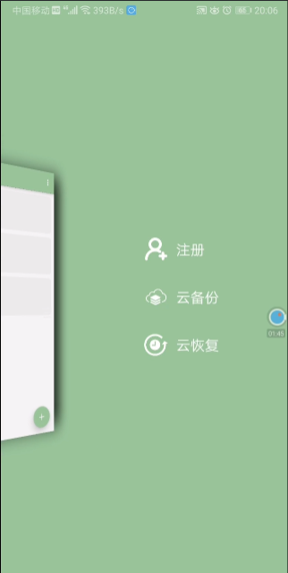
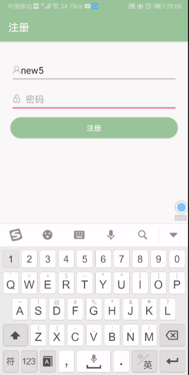

## 云备份
#### 点击云备份->用户登录验证->便签上传至服务器保存
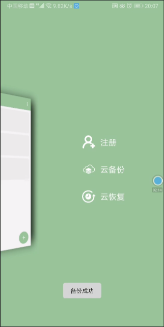

## 云恢复
#### 点击云恢复->用户登录验证->从服务器下载便签
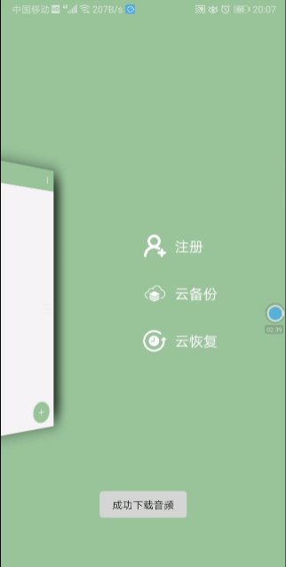
